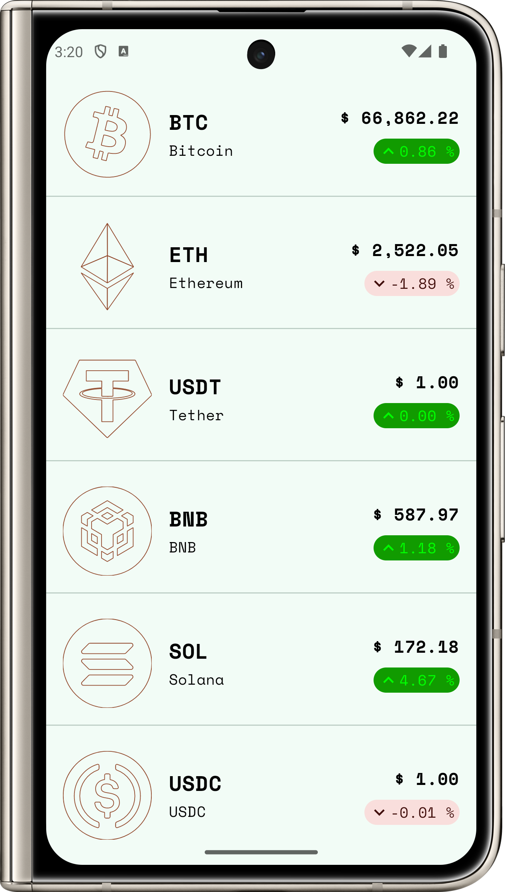
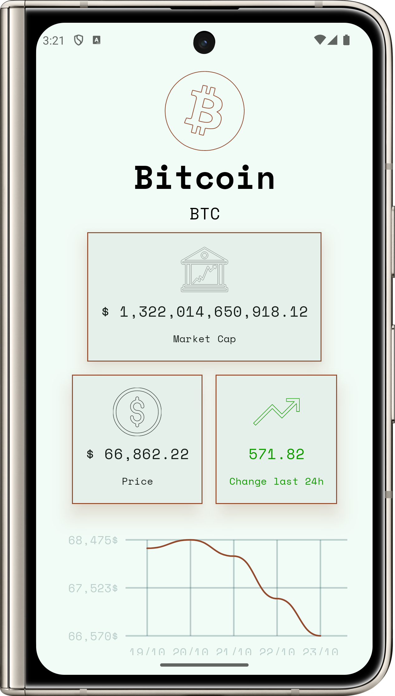
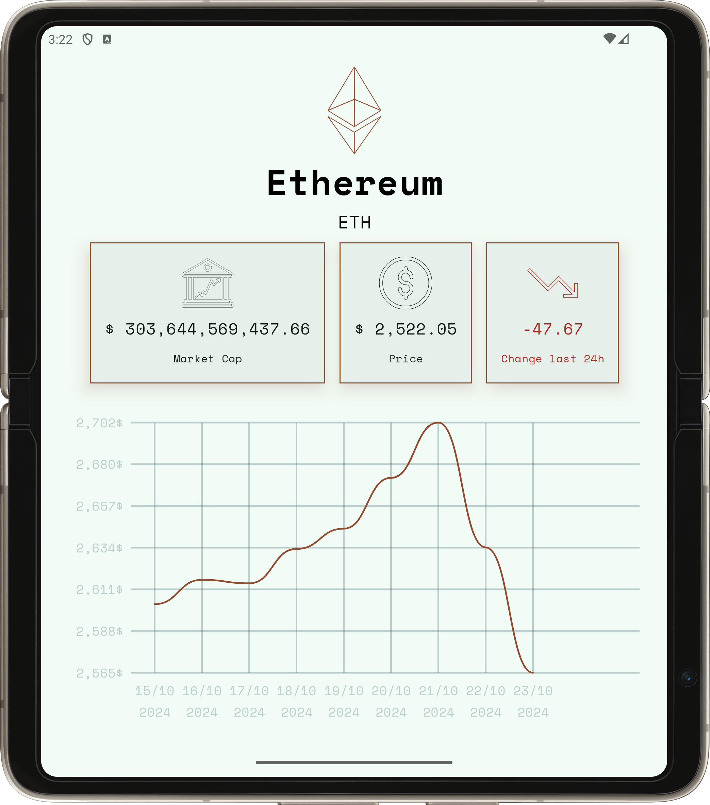
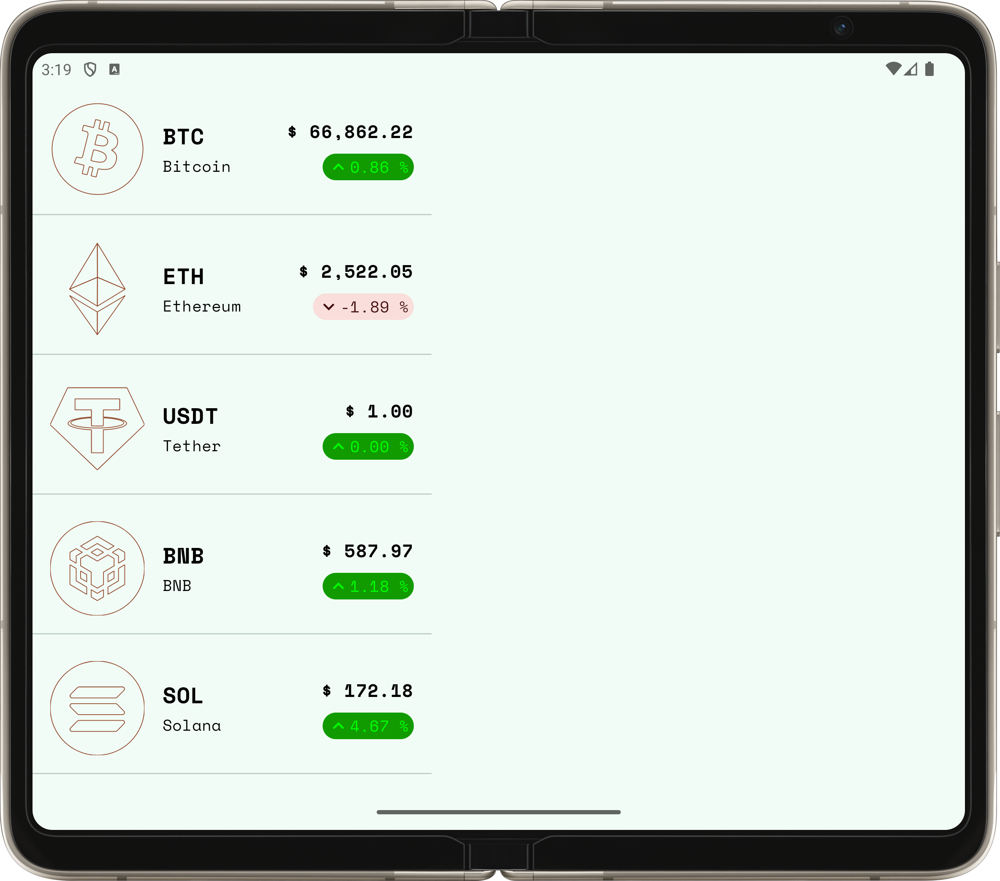
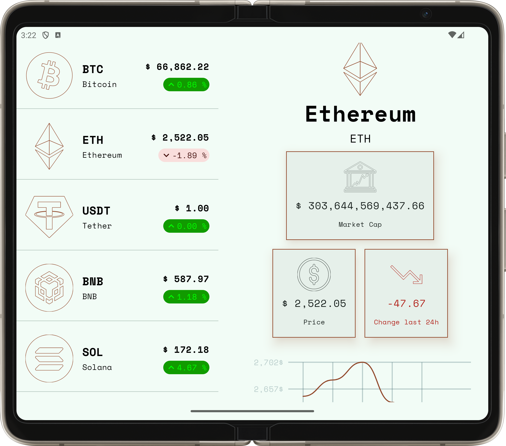

# Crypto Tracker
## An Android app to track crypto coins. This app is developed by following the best practices during an android development.

# Used Technology
* Kotlin
* Jetpack-Compose
* Adaptive-Navigation
* Ktor
* Koin
* MVI

# UI Demo

## 1 For Mobile [ Potrait Mode ]
 &nbsp; &nbsp;

## 2 For Mobile or Tablet [ Landscape Mode ]

 
 

## 3 For Foldable [ Full Expanded Mode ]

 
 

